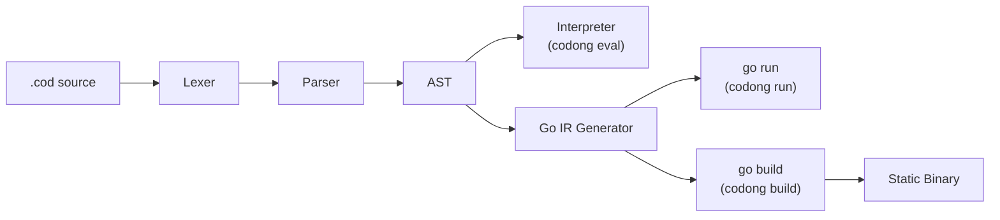
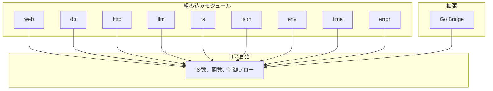
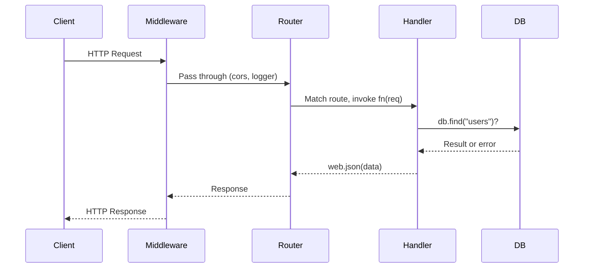
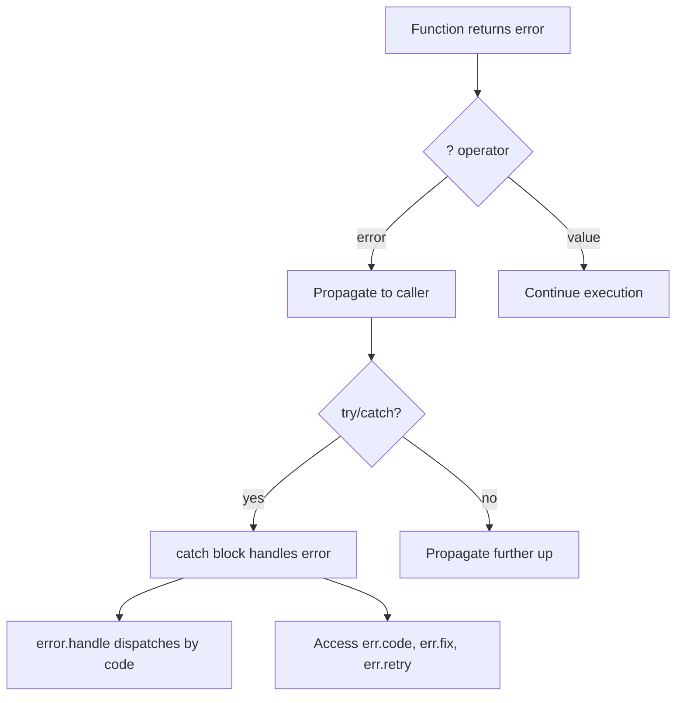

<p align="center">
  <strong>CODONG</strong><br>
  世界初の AI ネイティブプログラミング言語
</p>

<p align="center">
  <a href="https://codong.org">ウェブサイト</a> |
  <a href="https://codong.org/arena/">Arena</a> |
  <a href="../SPEC.md">仕様書</a> |
  <a href="../WHITEPAPER.md">ホワイトペーパー</a> |
  <a href="../SPEC_FOR_AI.md">AI 仕様</a>
</p>

<p align="center">
  <a href="../LICENSE"></a>
  
  
  <a href="https://codong.org/arena/"></a>
</p>

<p align="center">
  <a href="../README.md">English</a> |
  <a href="./README_zh.md">中文</a> |
  <a href="./README_ko.md">한국어</a> |
  <a href="./README_ru.md">Русский</a> |
  <a href="./README_de.md">Deutsch</a>
</p>

---

## Arena ベンチマーク：Codong vs. 既存言語

AI モデルが同じアプリケーションを異なる言語で記述する場合、Codong は劇的に
少ないコード量、少ないトークン数で、より速く完了します。これらの数値は
[Codong Arena](https://codong.org/arena/) から取得されたもので、あらゆるモデルが同じ仕様を各言語で記述し、
結果が自動的に計測されます。

<p align="center">
  
  <br />
  <sub>ライブベンチマーク：Claude Sonnet 4 がタグ、検索、ページネーション付き Posts CRUD API を生成。<a href="https://codong.org/arena/">自分で試す</a></sub>
</p>

| 指標 | Codong | Python | JavaScript | Java | Go |
|------|--------|--------|------------|------|-----|
| 総トークン数 | **955** | 1,867 | 1,710 | 4,367 | 3,270 |
| 生成時間 | **8.6s** | 15.3s | 13.7s | 37.4s | 26.6s |
| コード行数 | **10** | 143 | 147 | 337 | 289 |
| 推定コスト | **$0.012** | $0.025 | $0.022 | $0.062 | $0.046 |
| 出力トークン数 | **722** | 1,597 | 1,439 | 4,096 | 3,001 |
| Codong 比 | -- | +121% | +99% | +467% | +316% |

独自のベンチマークを実行：[codong.org/arena](https://codong.org/arena/)

---

## 30 秒クイックスタート

```bash
# 1. バイナリをダウンロード
curl -fsSL https://codong.org/install.sh | sh

# 2. 最初のプログラムを書く
echo 'print("Hello, Codong!")' > hello.cod

# 3. 実行する
codong eval hello.cod
```

5 行で Web API：

```
web.get("/", fn(req) => web.json({message: "Hello from Codong"}))
web.get("/health", fn(req) => web.json({status: "ok"}))
server = web.serve(port: 8080)
```

```bash
codong run server.cod
# curl http://localhost:8080/
```

---

## AI に Codong を書かせる —— インストール不要

Codong を使い始めるのにインストールは不要です。
[`SPEC_FOR_AI.md`](../SPEC_FOR_AI.md) ファイルを任意の LLM（Claude、GPT、Gemini、LLaMA）に
システムプロンプトまたはコンテキストとして送信すれば、AI はすぐに正しい Codong コードを記述できます。

**ステップ 1.** [`SPEC_FOR_AI.md`](../SPEC_FOR_AI.md) の内容をコピー（2,000 語未満）。

**ステップ 2.** AI との会話にコンテキストとして貼り付け：

```
[ここに SPEC_FOR_AI.md の内容を貼り付け]

Codong で REST API を書いてください。ユーザーリストの
CRUD 操作と SQLite ストレージを実装してください。
```

**ステップ 3.** AI が有効な Codong コードを生成：

```
db.connect("sqlite:///users.db")
db.create_table("users", {id: "integer primary key autoincrement", name: "text", email: "text"})
server = web.serve(port: 8080)
server.get("/users", fn(req) { return web.json(db.find("users")) })
server.post("/users", fn(req) { return web.json(db.insert("users", req.body), 201) })
server.get("/users/:id", fn(req) { return web.json(db.find_one("users", {id: to_number(req.param("id"))})) })
server.delete("/users/:id", fn(req) { db.delete("users", {id: to_number(req.param("id"))}); return web.json({}, 204) })
```

これが機能する理由は、Codong がすべての操作に対して単一の明確な構文で設計されているためです。
AI はフレームワーク、インポートスタイル、競合するパターンの中から選ぶ必要がありません。
すべてに正しい書き方が一つだけ。

| LLM プロバイダー | 方法 |
|-----------------|------|
| Claude (Anthropic) | SPEC をシステムプロンプトに貼り付け、または繰り返し使用には [Prompt Caching](https://docs.anthropic.com/en/docs/build-with-claude/prompt-caching) を利用 |
| GPT (OpenAI) | 最初のユーザーメッセージまたはシステム指示として SPEC を貼り付け |
| Gemini (Google) | 会話のコンテキストとして SPEC を貼り付け |
| LLaMA / Ollama | API または Ollama modelfile でシステムプロンプトに SPEC を含める |
| 任意の LLM | システムプロンプトまたはコンテキストウィンドウを受け入れるあらゆるモデルで動作 |

> **自分でベンチマーク**：[codong.org/arena](https://codong.org/arena/) にアクセスして、
> Codong と他の言語のリアルタイムのトークン消費量と生成速度を比較できます。

---

## なぜ Codong なのか

ほとんどのプログラミング言語は、人間が書き、マシンが実行するために設計されました。Codong は
AI が書き、人間がレビューし、マシンが実行するために設計されています。AI 生成コードにおける
3 つの最大の摩擦要因を排除します。

### 問題 1：選択肢の多さがトークンを浪費する

Python には HTTP リクエストを行う方法が 5 つ以上あります。選択するたびにトークンが消費され、
予測不可能な出力が生成されます。Codong ではすべてのことに方法は一つだけです。

| タスク | Python の選択肢 | Codong |
|--------|----------------|--------|
| HTTP リクエスト | requests, urllib, httpx, aiohttp, http.client | `http.get(url)` |
| Web サーバー | Flask, FastAPI, Django, Starlette, Tornado | `web.serve(port: N)` |
| データベース | SQLAlchemy, psycopg2, pymongo, peewee, Django ORM | `db.connect(url)` |
| JSON パース | json.loads, orjson, ujson, simplejson | `json.parse(s)` |

### 問題 2：エラーが AI に読めない

スタックトレースは人間向けに設計されています。AI エージェントは
`Traceback (most recent call last)` を解析するために数百トークンを費やしてから修正を試みます。
Codong では、すべてのエラーが構造化 JSON で、`fix` フィールドが AI に正確に何をすべきかを伝えます。

```json
{
  "error":   "db.find",
  "code":    "E2001_NOT_FOUND",
  "message": "table 'users' not found",
  "fix":     "run db.migrate() to create the table",
  "retry":   false
}
```

### 問題 3：パッケージ選択がコンテキストを浪費する

ビジネスロジックを書く前に、AI は HTTP ライブラリ、データベースドライバー、JSON
パーサーを選び、バージョンの競合を解決し、設定する必要があります。Codong は 8 つの
組み込みモジュールを提供し、AI ワークロードの 90% をカバーします。パッケージマネージャー不要。

### 結果：70% 以上のトークン削減

| トークンコスト | Python/JS | Codong | 削減 |
|--------------|-----------|--------|------|
| HTTP フレームワーク選択 | ~300 | 0 | 100% |
| データベース ORM 選択 | ~400 | 0 | 100% |
| エラーメッセージ解析 | ~500 | ~50 | 90% |
| パッケージバージョン解決 | ~800 | 0 | 100% |
| ビジネスロジック記述 | ~800 | ~800 | 0% |
| **合計** | **~2,800** | **~850** | **~70%** |

---

## 言語設計

Codong は意図的に小さくしています。23 キーワード。6 つのプリミティブ型。すべてのことに一つの方法。

### 23 キーワード（Python：35、JavaScript：64、Java：67）

```
fn       return   if       else     for      while    match
break    continue const    import   export   try      catch
go       select   interface type    null     true     false
in       _
```

### 変数

```
name = "Ada"
age = 30
active = true
nothing = null
const MAX_RETRIES = 3
```

`var`、`let`、`:=` はありません。代入は常に `=` です。

### 関数

```
fn greet(name, greeting = "Hello") {
    return "{greeting}, {name}!"
}

print(greet("Ada"))                    // Hello, Ada!
print(greet("Bob", greeting: "Hi"))    // Hi, Bob!

double = fn(x) => x * 2               // アロー関数
```

### 文字列補間

```
name = "Ada"
print("Hello, {name}!")                      // 変数
print("Total: {items.len()} items")          // メソッド呼び出し
print("Sum: {a + b}")                        // 式
print("{user.name} joined on {user.date}")   // メンバーアクセス
```

`{}` 内には任意の式が有効です。バッククォートなし、`f"..."` なし、`${}` なし。

### コレクション

```
items = [1, 2, 3, 4, 5]
doubled = items.map(fn(x) => x * 2)
evens = items.filter(fn(x) => x % 2 == 0)
total = items.reduce(fn(acc, x) => acc + x, 0)

user = {name: "Ada", age: 30}
user.email = "ada@example.com"
print(user.get("phone", "N/A"))        // N/A
```

### 制御フロー

```
if score >= 90 {
    print("A")
} else if score >= 80 {
    print("B")
} else {
    print("C")
}

for item in items {
    print(item)
}

for i in range(0, 10) {
    print(i)
}

while running {
    data = poll()
}

match status {
    200 => print("ok")
    404 => print("not found")
    _   => print("error: {status}")
}
```

### `?` 演算子によるエラーハンドリング

```
fn divide(a, b) {
    if b == 0 {
        return error.new("E_MATH", "division by zero")
    }
    return a / b
}

fn half_of_division(a, b) {
    result = divide(a, b)?
    return result / 2
}

try {
    half_of_division(10, 0)?
} catch err {
    print(err.code)       // E_MATH
    print(err.message)    // division by zero
}
```

`?` 演算子はエラーをコールスタック上に自動的に伝播します。ネストされた
`if err != nil` チェーンはありません。チェックされない例外もありません。

### コンパクトエラーフォーマット

コンパクトフォーマットに切り替えて、AI パイプラインで約 39% のトークンを節約：

```
error.set_format("compact")
// output: err_code:E_MATH|src:divide|fix:check divisor|retry:false
```

---

## アーキテクチャ

Codong ソースファイル（`.cod`）はマルチステージパイプラインで処理されます。インタープリターパスは
スクリプトと REPL の即時起動を提供します。Go IR パスはプロダクションデプロイメント用に
ネイティブ Go にコンパイルします。



### 実行モード

| モード | パイプライン | 起動時間 | ユースケース |
|--------|------------|---------|------------|
| `codong eval` | .cod -> AST -> インタープリター | サブ秒 | スクリプト、REPL、Playground |
| `codong run` | .cod -> AST -> Go IR -> `go run` | 0.3-2s | 開発、AI エージェント実行 |
| `codong build` | .cod -> AST -> Go IR -> `go build` | N/A（一度コンパイル） | プロダクションデプロイメント |

```bash
codong eval script.cod    # AST インタープリター、即時起動
codong run app.cod        # Go IR、フル標準ライブラリ、開発
codong build app.cod      # 単一静的バイナリ、プロダクション
```

### Go との関係

Codong は等価な Go コードにコンパイルし、Go ツールチェーンを活用して実行と
コンパイルを行います。これは TypeScript -> JavaScript や Kotlin -> JVM バイトコードと同じモデルです。

| Codong が提供 | Go が提供 |
|--------------|----------|
| AI ネイティブ構文設計 | メモリ管理、ガベージコレクション |
| 高制約ドメイン API | Goroutine 並行スケジューリング |
| 構造化 JSON エラーシステム | クロスプラットフォームコンパイル |
| 8 つの組み込みモジュール抽象化 | 実績のあるランタイム（10 年以上） |
| Go Bridge 拡張プロトコル | 数十万のエコシステムライブラリ |

---

## 組み込みモジュール

8 つのモジュールが Codong に同梱されています。インストール不要、バージョン衝突なし、選択不要。

| モジュール | 用途 | 主要メソッド |
|-----------|------|------------|
| [`web`](#web-モジュール) | HTTP サーバー、ルーティング、ミドルウェア、WebSocket | serve, get, post, put, delete |
| [`db`](#db-モジュール) | PostgreSQL、MySQL、MongoDB、Redis、SQLite | connect, find, insert, update, delete |
| [`http`](#http-モジュール) | HTTP クライアント | get, post, put, delete, patch |
| [`llm`](#llm-モジュール) | GPT、Claude、Gemini —— 統一インターフェース | ask, chat, stream, embed |
| [`fs`](#fs-モジュール) | ファイルシステム操作 | read, write, list, mkdir, stat |
| [`json`](#json-モジュール) | JSON 処理 | parse, stringify, valid, merge |
| [`env`](#env-モジュール) | 環境変数 | get, require, has, all, load |
| [`time`](#time-モジュール) | 日付、時刻、期間 | now, sleep, format, parse, diff |
| [`error`](#error-モジュール) | 構造化エラーの作成とハンドリング | new, wrap, handle, retry |



---

## コード例

### Hello World API

```
web.get("/", fn(req) => web.json({message: "Hello from Codong"}))
server = web.serve(port: 8080)
```

### TODO CRUD API

```
db.connect("file:todo.db")
db.query("CREATE TABLE IF NOT EXISTS todos (id INTEGER PRIMARY KEY AUTOINCREMENT, title TEXT, done INTEGER)")

web.get("/todos", fn(req) {
    return web.json(db.find("todos"))
})

web.post("/todos", fn(req) {
    db.insert("todos", {title: req.body.title, done: 0})
    return web.json({created: true})
})

web.put("/todos/{id}", fn(req) {
    db.update("todos", {id: to_number(req.param.id)}, {done: 1})
    return web.json({updated: true})
})

web.delete("/todos/{id}", fn(req) {
    db.delete("todos", {id: to_number(req.param.id)})
    return web.json({deleted: true})
})

server = web.serve(port: 3000)
```

### LLM 搭載エンドポイント

```
web.post("/ask", fn(req) {
    question = req.body.question
    context = db.find("docs", {relevant: true})?
    answer = llm.ask(
        model: "gpt-4o",
        prompt: "Answer using context: {context}\n\nQuestion: {question}",
        format: "json"
    )?
    return web.json(answer)
})

server = web.serve(port: 8080)
```

### ファイル処理スクリプト

```
files = fs.list("./data")
for file in files {
    if fs.extension(file) == ".csv" {
        content = fs.read(file)
        lines = content.split("\n")
        print("{fs.basename(file)}: {lines.len()} lines")
        fs.write("./output/{fs.basename(file)}.processed", content.upper())
    }
}
print("done")
```

### `?` 演算子によるエラーハンドリング

```
fn load_config(path) {
    content = fs.read(path)?
    config = json.parse(content)?
    host = config.get("host", "localhost")
    port = config.get("port", 8080)
    return {host: host, port: port}
}

try {
    config = load_config("config.json")?
    print("Server: {config.host}:{config.port}")
} catch err {
    print("Failed: {err.code} - {err.fix}")
}
```

---

## 完全 API リファレンス

### コア言語

#### データ型

| 型 | 例 | 備考 |
|----|---|------|
| `string` | `"hello"`, `"value is {x}"` | ダブルクォートのみ。`{expr}` 補間。 |
| `number` | `42`, `3.14`, `-1` | 64 ビット浮動小数点。 |
| `bool` | `true`, `false` | |
| `null` | `null` | `null` と `false` のみが偽値。 |
| `list` | `[1, 2, 3]` | ゼロインデックス。負のインデックス対応。 |
| `map` | `{name: "Ada"}` | 順序付き。ドットとブラケットアクセス。 |

#### 組み込み関数

| 関数 | 戻り値 | 説明 |
|------|--------|------|
| `print(value)` | null | stdout に出力。単一引数。複数値にはインターポレーションを使用。 |
| `type_of(x)` | string | `"string"`、`"number"`、`"bool"`、`"null"`、`"list"`、`"map"`、`"fn"` を返す。 |
| `to_string(x)` | string | 任意の値を文字列表現に変換。 |
| `to_number(x)` | number/null | 数値にパース。無効な場合は `null` を返す。 |
| `to_bool(x)` | bool | ブール値に変換。 |
| `range(start, end)` | list | `start` から `end - 1` までの整数。 |

#### 演算子

| 優先度 | 演算子 | 説明 |
|--------|--------|------|
| 1 | `()` `[]` `.` `?` | グルーピング、インデックス、メンバー、エラー伝播 |
| 2 | `!` `-`（単項） | 論理否定、符号反転 |
| 3 | `*` `/` `%` | 乗算、除算、剰余 |
| 4 | `+` `-` | 加算、減算 |
| 5 | `<` `>` `<=` `>=` | 比較 |
| 6 | `==` `!=` | 等価 |
| 7 | `&&` | 論理積 |
| 8 | `\|\|` | 論理和 |
| 9 | `<-` | チャネル送受信 |
| 10 | `=` `+=` `-=` `*=` `/=` | 代入 |

---

### 文字列メソッド

17 メソッド。すべて新しい文字列を返します（文字列は不変）。

| メソッド | 戻り値 | 説明 |
|---------|--------|------|
| `s.len()` | number | 文字列のバイト長。 |
| `s.upper()` | string | 大文字に変換。 |
| `s.lower()` | string | 小文字に変換。 |
| `s.trim()` | string | 前後の空白を除去。 |
| `s.trim_start()` | string | 先頭の空白を除去。 |
| `s.trim_end()` | string | 末尾の空白を除去。 |
| `s.split(sep)` | list | セパレーターで分割して文字列のリストに。 |
| `s.contains(sub)` | bool | 文字列が部分文字列を含む場合 `true` を返す。 |
| `s.starts_with(prefix)` | bool | 文字列がプレフィックスで始まる場合 `true` を返す。 |
| `s.ends_with(suffix)` | bool | 文字列がサフィックスで終わる場合 `true` を返す。 |
| `s.replace(old, new)` | string | すべての `old` を `new` に置換。 |
| `s.index_of(sub)` | number | 最初の出現位置のインデックス。存在しない場合は `-1`。 |
| `s.slice(start, end?)` | string | 部分文字列を抽出。`end` はオプション。 |
| `s.repeat(n)` | string | 文字列を `n` 回繰り返す。 |
| `s.to_number()` | number/null | 数値としてパース。無効な場合は `null`。 |
| `s.to_bool()` | bool | `"true"` / `"1"` は `true` を返す。それ以外は `false`。 |
| `s.match(pattern)` | list | 正規表現マッチ。すべてのマッチのリストを返す。 |

---

### リストメソッド

20 メソッド。変更メソッドは元のリストを変更し、チェーニング用に `self` を返します。

| メソッド | 変更 | 戻り値 | 説明 |
|---------|------|--------|------|
| `l.len()` | いいえ | number | 要素数。 |
| `l.push(item)` | **はい** | self | 末尾に要素を追加。 |
| `l.pop()` | **はい** | item | 最後の要素を削除して返す。 |
| `l.shift()` | **はい** | item | 最初の要素を削除して返す。 |
| `l.unshift(item)` | **はい** | self | 先頭に要素を挿入。 |
| `l.sort(fn?)` | **はい** | self | インプレースソート。オプションの比較関数。 |
| `l.reverse()` | **はい** | self | インプレースで反転。 |
| `l.slice(start, end?)` | いいえ | list | `start` から `end` までの新しいサブリスト。 |
| `l.map(fn)` | いいえ | list | 各要素に `fn` を適用した新しいリスト。 |
| `l.filter(fn)` | いいえ | list | `fn` が真を返す要素の新しいリスト。 |
| `l.reduce(fn, init)` | いいえ | any | `init` から `fn(acc, item)` で累積。 |
| `l.find(fn)` | いいえ | item/null | `fn` が真を返す最初の要素。 |
| `l.find_index(fn)` | いいえ | number | 最初のマッチのインデックス。なければ `-1`。 |
| `l.contains(item)` | いいえ | bool | リストが要素を含む場合 `true`。 |
| `l.index_of(item)` | いいえ | number | 最初の出現位置。存在しない場合は `-1`。 |
| `l.flat(depth?)` | いいえ | list | フラット化された新しいリスト。デフォルト深度は 1。 |
| `l.unique()` | いいえ | list | 重複を除去した新しいリスト。 |
| `l.join(sep)` | いいえ | string | セパレーターで要素を結合して文字列に。 |
| `l.first()` | いいえ | item/null | 最初の要素。空の場合は `null`。 |
| `l.last()` | いいえ | item/null | 最後の要素。空の場合は `null`。 |

---

### Map メソッド

10 メソッド。`delete` のみが元の map を変更します。

| メソッド | 変更 | 戻り値 | 説明 |
|---------|------|--------|------|
| `m.len()` | いいえ | number | キーバリューペアの数。 |
| `m.keys()` | いいえ | list | すべてのキーのリスト。 |
| `m.values()` | いいえ | list | すべての値のリスト。 |
| `m.entries()` | いいえ | list | `[key, value]` ペアのリスト。 |
| `m.has(key)` | いいえ | bool | キーが存在する場合 `true`。 |
| `m.get(key, default?)` | いいえ | any | キーで値を取得。存在しない場合は `default`（または `null`）。 |
| `m.delete(key)` | **はい** | self | キーバリューペアをインプレースで削除。 |
| `m.merge(other)` | いいえ | map | `other` を `self` にマージした新しい map。競合時は `other` が優先。 |
| `m.map_values(fn)` | いいえ | map | 各値に `fn` を適用した新しい map。 |
| `m.filter(fn)` | いいえ | map | `fn(key, value)` が真を返すエントリーの新しい map。 |

---

### web モジュール

ルーティング、ミドルウェア、WebSocket をサポートする HTTP サーバー。

#### サーバー

| メソッド | 説明 |
|---------|------|
| `web.serve(port: N)` | ポート `N` で HTTP サーバーを起動。サーバーハンドルを返す。 |

#### ルート登録

| メソッド | 説明 |
|---------|------|
| `web.get(path, handler)` | GET ルートを登録。 |
| `web.post(path, handler)` | POST ルートを登録。 |
| `web.put(path, handler)` | PUT ルートを登録。 |
| `web.delete(path, handler)` | DELETE ルートを登録。 |
| `web.patch(path, handler)` | PATCH ルートを登録。 |

ルートハンドラーはリクエストオブジェクトを受け取ります：`req.body`、`req.param`、`req.query`、`req.headers`。

#### レスポンスヘルパー

| メソッド | 説明 |
|---------|------|
| `web.json(data)` | `Content-Type: application/json` で JSON レスポンスを返す。 |
| `web.text(string)` | プレーンテキストレスポンスを返す。 |
| `web.html(string)` | HTML レスポンスを返す。 |
| `web.redirect(url)` | リダイレクトレスポンスを返す。 |
| `web.response(status, body, headers)` | ステータスコードとヘッダー付きのカスタムレスポンスを返す。 |

#### 静的ファイルとミドルウェア

| メソッド | 説明 |
|---------|------|
| `web.static(path, dir)` | ディレクトリから静的ファイルを配信。 |
| `web.middleware(name_or_fn)` | ミドルウェアを適用。組み込み：`"cors"`、`"logger"`、`"recover"`、`"auth_bearer"`。 |
| `web.ws(path, handler)` | WebSocket エンドポイントを登録。 |

```
// ミドルウェアの例
web.middleware("cors")
web.middleware("logger")
web.middleware(fn(req, next) {
    print("Request: {req.method} {req.path}")
    return next(req)
})
```



---

### db モジュール

SQL および NoSQL データベースの統一インターフェース。

#### 接続

| メソッド | 説明 |
|---------|------|
| `db.connect(url)` | データベースに接続。URL でドライバーを決定：`postgres://`、`mysql://`、`mongodb://`、`redis://`、`file:`（SQLite）。 |

#### スキーマ

| メソッド | 説明 |
|---------|------|
| `db.create_table(name, schema)` | スキーマ map でテーブルを作成。 |
| `db.create_index(table, fields)` | 指定フィールドにインデックスを作成。 |

#### CRUD 操作

| メソッド | 説明 |
|---------|------|
| `db.insert(table, data)` | 単一レコードを挿入。 |
| `db.insert_batch(table, list)` | 複数レコードを一括挿入。 |
| `db.find(table, filter?)` | マッチするすべてのレコードを検索。リストを返す。 |
| `db.find_one(table, filter)` | 最初のマッチするレコードを検索。map または null を返す。 |
| `db.update(table, filter, data)` | マッチするレコードを新しいデータで更新。 |
| `db.delete(table, filter)` | マッチするレコードを削除。 |
| `db.upsert(table, filter, data)` | 存在する場合は更新、しない場合は挿入。 |

#### クエリと集計

| メソッド | 説明 |
|---------|------|
| `db.count(table, filter?)` | マッチするレコード数をカウント。 |
| `db.exists(table, filter)` | マッチするレコードがあれば `true` を返す。 |
| `db.query(sql, params?)` | 生 SQL クエリを実行。`?` プレースホルダーを使用。 |
| `db.query_one(sql, params?)` | 生 SQL を実行し、最初の結果を返す。 |
| `db.transaction(fn)` | トランザクション内で関数を実行。 |
| `db.stats()` | コネクションプール統計を返す。 |

```
db.connect("file:app.db")
db.insert("users", {name: "Ada", role: "engineer"})
engineers = db.find("users", {role: "engineer"})
db.update("users", {name: "Ada"}, {role: "senior engineer"})
count = db.count("users")
```

---

### http モジュール

外部リクエストを行うための HTTP クライアント。

| メソッド | 説明 |
|---------|------|
| `http.get(url, options?)` | GET リクエストを送信。レスポンスオブジェクトを返す。 |
| `http.post(url, body?, options?)` | オプションの JSON ボディ付き POST リクエストを送信。 |
| `http.put(url, body?, options?)` | PUT リクエストを送信。 |
| `http.delete(url, options?)` | DELETE リクエストを送信。 |
| `http.patch(url, body?, options?)` | PATCH リクエストを送信。 |
| `http.request(method, url, options)` | カスタムメソッドとフルオプションでリクエストを送信。 |

レスポンスオブジェクト：`resp.status`（数値）、`resp.ok`（ブール）、`resp.json()`（パース済み JSON）、
`resp.text()`（生ボディ）、`resp.headers`（map）。

```
resp = http.get("https://api.example.com/users")
if resp.ok {
    users = resp.json()
    print("Found {users.len()} users")
}

resp = http.post("https://api.example.com/users", {
    name: "Ada",
    role: "engineer"
})
```

---

### llm モジュール

大規模言語モデルの統一インターフェース。GPT、Claude、Gemini、および
OpenAI 互換 API をサポート。

| メソッド | 説明 |
|---------|------|
| `llm.ask(prompt, model:, system?:, format?:)` | 単一プロンプト、単一レスポンス。`format: "json"` で構造化データを返す。 |
| `llm.chat(messages, model:)` | マルチターン会話。メッセージ：`[{role:, content:}]`。 |
| `llm.stream(prompt, model:, on_chunk:)` | トークンごとにレスポンスをストリーム。 |
| `llm.embed(text, model:)` | 埋め込みベクトルを生成。 |
| `llm.count_tokens(text)` | テキストのトークン数を推定。 |

```
// 単一の質問
answer = llm.ask("What is 2+2?", model: "gpt-4o")

// 構造化出力
data = llm.ask("List 3 colors", model: "gpt-4o", format: "json")

// マルチターン会話
response = llm.chat([
    {role: "system", content: "You are a helpful assistant."},
    {role: "user", content: "What is Codong?"},
    {role: "assistant", content: "Codong is an AI-native programming language."},
    {role: "user", content: "What makes it special?"}
], model: "claude-sonnet-4-20250514")

// トークン推定
tokens = llm.count_tokens("Hello, this is a test.")
print("Tokens: {tokens}")
```

---

### fs モジュール

ファイルとディレクトリの読み書きと管理のためのファイルシステム操作。

#### ファイル操作

| メソッド | 説明 |
|---------|------|
| `fs.read(path)` | ファイル全体を文字列として読み取り。 |
| `fs.write(path, content)` | 文字列をファイルに書き込み（上書き）。 |
| `fs.append(path, content)` | 文字列をファイルに追記。 |
| `fs.delete(path)` | ファイルを削除。 |
| `fs.copy(src, dst)` | `src` から `dst` にファイルをコピー。 |
| `fs.move(src, dst)` | ファイルを移動/リネーム。 |
| `fs.exists(path)` | パスが存在する場合 `true` を返す。 |

#### ディレクトリ操作

| メソッド | 説明 |
|---------|------|
| `fs.list(dir)` | ディレクトリ内のファイルをリスト。パスのリストを返す。 |
| `fs.mkdir(path)` | ディレクトリを作成（親ディレクトリ含む）。 |
| `fs.rmdir(path)` | ディレクトリを削除。 |
| `fs.stat(path)` | ファイルメタデータを返す：サイズ、更新日時、is_dir。 |

#### 構造化 I/O

| メソッド | 説明 |
|---------|------|
| `fs.read_json(path)` | JSON ファイルを読み取りパース。 |
| `fs.write_json(path, data)` | データをフォーマット済み JSON として書き込み。 |
| `fs.read_lines(path)` | ファイルを行のリストとして読み取り。 |
| `fs.write_lines(path, lines)` | 行のリストをファイルに書き込み。 |

#### パスユーティリティ

| メソッド | 説明 |
|---------|------|
| `fs.join(parts...)` | パスセグメントを結合。 |
| `fs.cwd()` | 現在の作業ディレクトリを返す。 |
| `fs.basename(path)` | パスからファイル名を返す。 |
| `fs.dirname(path)` | パスからディレクトリを返す。 |
| `fs.extension(path)` | ファイル拡張子を返す。 |
| `fs.safe_join(base, path)` | ディレクトリトラバーサル保護付きでパスを結合。 |
| `fs.temp_file(prefix?)` | 一時ファイルを作成。パスを返す。 |
| `fs.temp_dir(prefix?)` | 一時ディレクトリを作成。パスを返す。 |

---

### json モジュール

JSON のパース、生成、操作。

| メソッド | 説明 |
|---------|------|
| `json.parse(string)` | JSON 文字列を Codong 値（map、list など）にパース。 |
| `json.stringify(value)` | Codong 値を JSON 文字列に変換。 |
| `json.valid(string)` | 文字列が有効な JSON であれば `true` を返す。 |
| `json.merge(a, b)` | 2 つの map をディープマージ。競合時は `b` が優先。 |
| `json.get(value, path)` | ドットパスでネストされた値を取得（例：`"user.name"`）。 |
| `json.set(value, path, new_val)` | ドットパスでネストされた値を設定。新しい構造を返す。 |
| `json.flatten(value)` | ネストされた map をドット表記のキーにフラット化。 |
| `json.unflatten(value)` | ドット表記のキーをネストされた map に展開。 |

```
data = json.parse("{\"name\": \"Ada\", \"age\": 30}")
text = json.stringify({name: "Ada", scores: [95, 87, 92]})
name = json.get(data, "name")
```

---

### env モジュール

環境変数のアクセスと `.env` ファイルの読み込み。

| メソッド | 説明 |
|---------|------|
| `env.get(key, default?)` | 環境変数を取得。未設定の場合は `default`（または `null`）を返す。 |
| `env.require(key)` | 環境変数を取得。未設定の場合はエラーを返す。 |
| `env.has(key)` | 環境変数が設定されていれば `true` を返す。 |
| `env.all()` | すべての環境変数の map を返す。 |
| `env.load(path?)` | `.env` ファイルを読み込み。デフォルトパス：`.env`。 |

```
env.load()
api_key = env.require("OPENAI_API_KEY")?
db_url = env.get("DATABASE_URL", "file:dev.db")
```

---

### time モジュール

日付、時刻、期間、スケジューリングユーティリティ。

| メソッド | 説明 |
|---------|------|
| `time.sleep(ms)` | `ms` ミリ秒実行を一時停止。 |
| `time.now()` | 現在の Unix タイムスタンプ（ミリ秒）。 |
| `time.now_iso()` | 現在時刻の ISO 8601 文字列。 |
| `time.format(timestamp, pattern)` | パターンでタイムスタンプをフォーマット。 |
| `time.parse(string, pattern)` | 時刻文字列をタイムスタンプにパース。 |
| `time.diff(a, b)` | 2 つのタイムスタンプの差（ミリ秒）。 |
| `time.since(timestamp)` | 指定タイムスタンプからの経過ミリ秒。 |
| `time.until(timestamp)` | 指定タイムスタンプまでのミリ秒。 |
| `time.add(timestamp, ms)` | タイムスタンプにミリ秒を加算。 |
| `time.is_before(a, b)` | `a` が `b` より前であれば `true`。 |
| `time.is_after(a, b)` | `a` が `b` より後であれば `true`。 |
| `time.today_start()` | 今日の開始タイムスタンプ（00:00:00）。 |
| `time.today_end()` | 今日の終了タイムスタンプ（23:59:59）。 |

```
start = time.now()
time.sleep(100)
elapsed = time.since(start)
print("Elapsed: {elapsed}ms")
print("Current time: {time.now_iso()}")
```

---

### error モジュール

構造化エラーの作成、ラッピング、フォーマット、ディスパッチ。

| メソッド | 説明 |
|---------|------|
| `error.new(code, message, fix?:, retry?:)` | 新しい構造化エラーを作成。 |
| `error.wrap(err, context)` | 既存のエラーにコンテキストを追加。 |
| `error.is(value)` | 値がエラーオブジェクトであれば `true` を返す。 |
| `error.unwrap(err)` | ラップされたエラーの内部エラーを返す。 |
| `error.to_json(err)` | エラーを JSON 文字列に変換。 |
| `error.to_compact(err)` | エラーをコンパクトフォーマット文字列に変換。 |
| `error.from_json(string)` | JSON 文字列をエラーオブジェクトにパース。 |
| `error.from_compact(string)` | コンパクトフォーマット文字列をエラーオブジェクトにパース。 |
| `error.set_format(fmt)` | グローバルフォーマットを設定：`"json"`（デフォルト）または `"compact"`。 |
| `error.handle(result, handlers)` | エラーコードでディスパッチ。`code -> fn(err)` の map。デフォルトには `"_"` を使用。 |
| `error.retry(fn, max_attempts)` | リトライ可能なエラーを返す関数を自動リトライ。 |

```
err = error.new("E_INVALID", "bad input", fix: "check the value")

result = error.handle(some_result, {
    "E_NOT_FOUND": fn(err) => "Missing: {err.fix}",
    "E_TIMEOUT": fn(err) => "Timed out",
    "_": fn(err) => "Unknown: {err.code}"
})

final = error.retry(fn() {
    return http.get("https://api.example.com/data")
}, 3)
```



---

## 並行性

Codong は Go スタイルの並行性を使用し、goroutine とチャネルを採用しています。

```
// 並行実行を開始
go fn() {
    data = fetch_data()
    ch <- data
}()

// チャネル
ch = channel()
ch <- "message"           // 送信
msg = <-ch                // 受信

// バッファ付きチャネル
ch = channel(size: 10)

// Select（多重化）
select {
    msg = <-ch1 {
        handle(msg)
    }
    msg = <-ch2 {
        process(msg)
    }
    <-done {
        break
    }
}
```

---

## Go Bridge

8 つの組み込みモジュール以外の機能が必要な場合、Go Bridge により人間のアーキテクトが
任意の Go パッケージを AI 向けにラップできます。AI は関数名と戻り値のみを参照します。
権限は明示的に宣言されます。

### 登録（codong.toml）

```toml
[bridge]
pdf_render = { fn = "bridge.RenderPDF", permissions = ["fs:write:/tmp/output"] }
wechat_pay = { fn = "bridge.WechatPay", permissions = ["net:outbound"] }
hash_md5   = { fn = "bridge.HashMD5", permissions = [] }
```

### 権限タイプ

| 権限 | フォーマット | スコープ |
|------|------------|---------|
| なし | `[]` | 純粋な計算、I/O なし |
| ネットワーク | `["net:outbound"]` | アウトバウンド HTTP のみ |
| ファイル読み取り | `["fs:read:<path>"]` | 指定ディレクトリからの読み取り |
| ファイル書き込み | `["fs:write:<path>"]` | 指定ディレクトリへの書き込み |

### .cod ファイルでの使用

```
result = pdf_render(html: content, output: "report.pdf")
if result.error {
    print("render failed: {result.error}")
}
```

Bridge 関数での禁止操作：`os.Exit`、`syscall`、`os/exec`、`net.Listen`、
ホストルートファイルシステムアクセス。

---

## 型システム

型アノテーションは、`agent.tool` による自動 JSON Schema 生成を使用する場合を除き、
すべての場所でオプションです。

```
// 型宣言
type User = {
    name: string,
    age: number,
    email: string,
}

// インターフェース（構造的型付け）
interface Searchable {
    fn search(query: string) => list
}

// agent.tool 用のアノテーション付き関数
fn search(query: string, limit: number) {
    return db.find("docs", {q: query}, limit: limit)
}

// agent.tool がアノテーションを読み取り、JSON Schema を自動生成
agent.tool("search", search, "Search the knowledge base")
```

---

## モジュールシステム

組み込みモジュールは直接利用可能。カスタムモジュールは `import`/`export` を使用。

```
// math_utils.cod
export fn square(x) { return x * x }
export const PI = 3.14159

// main.cod
import { square, PI } from "./math_utils.cod"
```

サードパーティパッケージは名前の占有を防ぐためにスコープ付き名前を使用：

```
import { verify } from "@codong/jwt"
import { hash } from "@alice/crypto"
```

`codong.lock` が SHA-256 ハッシュに固定された 100% 再現可能なビルドを保証。

---

## AI 統合

Codong は初日から AI による使用を前提に設計されています。

### 方法 1：SPEC.md インジェクション（現在利用可能）

[`SPEC_FOR_AI.md`](../SPEC_FOR_AI.md)（2,000 語未満）を任意の LLM システムプロンプトに注入。
モデルは何もインストールせずにすぐに正しい Codong コードを記述できます。

### 方法 2：MCP Server（Claude Desktop）

公式 MCP Server により、Claude Desktop が Codong を記述、コンパイル、ローカルで実行可能。
Codong はネイティブ AI 物理実行機能を持つ最初のプログラミング言語です。

### 方法 3：OpenAI Function Calling

Codong エグゼキューターを関数として登録。GPT が会話内で Codong コードを記述・実行。

---

## 必須コードスタイル

| ルール | 標準 |
|--------|------|
| インデント | 4 スペース（タブ禁止） |
| 命名 | 変数、関数、モジュールは `snake_case` |
| 型名 | `PascalCase` |
| 行の長さ | 最大 120 文字 |
| 中括弧 | 開き `{` は同じ行 |
| 文字列 | ダブルクォート `"` のみ（シングルクォート禁止） |
| 末尾カンマ | 複数行の list/map で必須 |

`codong fmt` がすべてのスタイルルールを自動的に適用。

---

## エコシステム互換性

| カテゴリー | サポート |
|-----------|---------|
| AI モデル | GPT-4o、Claude 3.5、Gemini 1.5 Pro、Llama 3、任意の OpenAI 互換 API |
| データベース | PostgreSQL、MySQL、MongoDB、Redis、SQLite、Pinecone、Qdrant、Supabase |
| クラウド | AWS、GCP、Azure、Cloudflare R2、Vercel |
| メッセージキュー | Kafka、RabbitMQ、AWS SQS、NATS |
| コンテナ | Docker、Kubernetes、Helm、Terraform |
| 拡張 | Go Bridge 経由で任意の Go ライブラリ |

---

## ロードマップ

| ステージ | 状態 | 成果物 |
|---------|------|--------|
| 0 | 完了 | SPEC.md —— AI がコンパイラなしで Codong を記述可能 |
| 1 | 完了 | `codong eval` —— コア言語、error モジュール、CLI |
| 2 | 進行中 | `web`、`db`、`http`、`llm` モジュール |
| 3 | 計画中 | `agent`、`cloud`、`queue`、`cron` モジュール |
| 4 | 計画中 | `codong build` —— 単一静的バイナリ |
| 5 | 計画中 | 50 サンプル + 完全ドキュメント |
| 6 | 計画中 | codong.org + ブラウザ Playground（WASM） |
| 7 | 計画中 | VS Code 拡張 + Claude Desktop MCP Server |
| 8 | 計画中 | パッケージレジストリ + `codong.lock` |

---

## プロジェクト構造

```
Codong/
  cmd/              CLI エントリーポイント（codong eval、run、build）
  engine/
    lexer/          トークナイザー
    parser/         パーサー（AST を生成）
    interpreter/    ツリーウォーキングインタープリター（codong eval）
    goirgen/        Go IR コードジェネレーター（codong run/build）
    runner/         Go ツールチェーンランナー
  stdlib/           標準ライブラリ実装
  examples/         57 のサンプルプログラム（01_hello.cod から 57_llm_module.cod まで）
  tests/            テストハーネス
  SPEC.md           完全な言語仕様
  SPEC_FOR_AI.md    正誤例付き AI 最適化仕様
  WHITEPAPER.md     設計根拠とアーキテクチャビジョン
```

---

## 言語リファレンス

完全な言語仕様については [`SPEC.md`](../SPEC.md) を参照。

すべてのルールの正誤例付き AI 最適化バージョンについては
[`SPEC_FOR_AI.md`](../SPEC_FOR_AI.md) を参照。任意の LLM システムプロンプトに注入すれば、
何もインストールせずに正しい Codong コード生成が可能。

設計根拠、アーキテクチャの決定、プロジェクトビジョンの全体については
[`WHITEPAPER.md`](../WHITEPAPER.md) を参照。

---

## コントリビュート

Codong は MIT ライセンスで、コントリビュートを歓迎しています。

**はじめに：**

```bash
git clone https://github.com/brettinhere/Codong.git
cd Codong
go build ./cmd/codong
./codong eval examples/01_hello.cod
```

**コントリビュート先：**

| エリア | インパクト | 難易度 |
|--------|----------|--------|
| Go IR ジェネレーター（`engine/goirgen/`） | 最高レバレッジ | 上級 |
| 標準ライブラリモジュール（`stdlib/`） | 高 | 中級 |
| サンプルプログラム（`examples/`） | コミュニティ成長 | 初級 |
| バグ報告とテストケース | 品質 | すべてのレベル |

**ガイドライン：**

- コードを書く前に [`SPEC.md`](../SPEC.md) を読んでください。
- `tests/run_examples.sh` を実行してすべてのサンプルが通ることを確認。
- プルリクエストごとに 1 つの機能。
- 必須コードスタイルに従う（4 スペース、`snake_case`、ダブルクォート）。

---

## リンク

| リソース | URL |
|---------|-----|
| ウェブサイト | [codong.org](https://codong.org) |
| Arena（ライブベンチマーク） | [codong.org/arena](https://codong.org/arena/) |
| GitHub | [github.com/brettinhere/Codong](https://github.com/brettinhere/Codong) |
| Arena リポジトリ | [github.com/brettinhere/codong-arena](https://github.com/brettinhere/codong-arena) |

---

## ライセンス

MIT —— [LICENSE](../LICENSE) を参照

---

CODONG -- codong.org -- 世界初の AI ネイティブプログラミング言語
